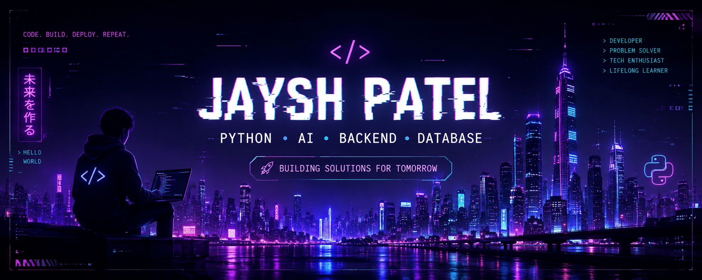

# 👋 Hey, I'm Jaysh!

### 🐍 Python • 🤖 AI • ⚙️ Backend & Database

**Build • Learn • Repeat 🚀**

 

---

## 👨‍💻 About Me

- 🐍 Python Developer
- 🤖 AI & ML Enthusiast
- 🗄️ Database & Backend
- ☕ Java Developer
- ⚡ Building practical projects
- 🚀 Learning new technologies

---

## 🛠️ Tech Stack

---

## 🚀 Featured Projects

<table>
<tr>

<td width="50%">

### 🧠 ResumeMatcher

AI-powered resume matching system that analyzes resumes against job descriptions.

**Python • AI/NLP • SQLite**

</td>

<td width="50%">

### 🏥 MediGrid

Hospital operations and database management system.

**Python • Backend • Database**

</td>

</tr>

<tr>

<td width="50%">

### 🤖 RootEase AI

AI-focused project exploring intelligent automation.

**Python • AI**

</td>

<td width="50%">

### ⚡ More Projects

Check out my repositories for more projects and experiments.

<a href="https://github.com/jayshpatelfc-afk?tab=repositories">
View All Projects →
</a>

</td>

</tr>
</table>

---

## 👀 Profile Views

  

### 💡 Build • Learn • Break • Repeat 🚀

---

